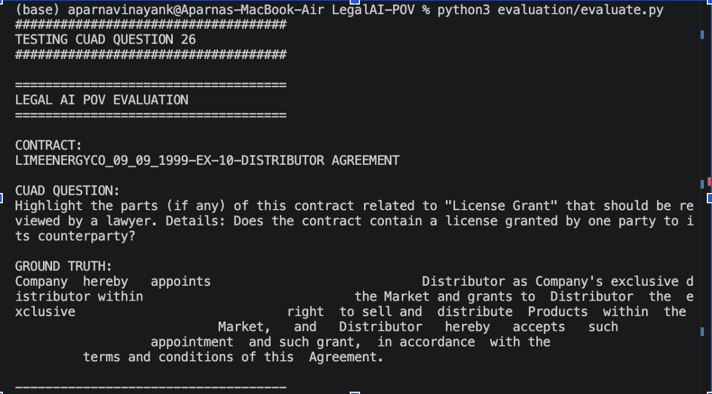
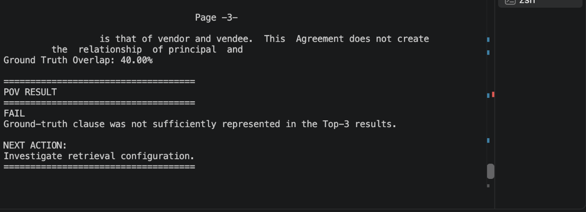
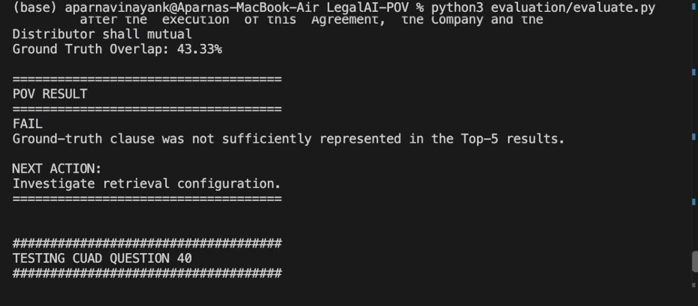
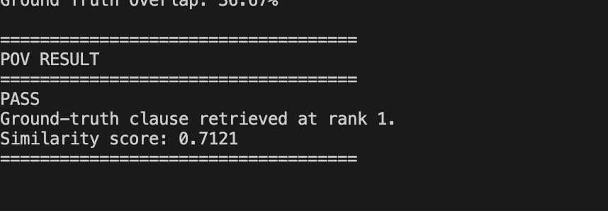

# Legal AI Proof of Value

A simple Legal AI Proof of Value (PoV) for contract clause identification and grounded contract analysis.

## Objective

The project explores whether an AI workflow can identify relevant contractual provisions and generate answers grounded in contract evidence.

## Use Case

Identify and analyse clauses in commercial contracts, including provisions such as:

- Termination
- License Grant
- Contractual rights and obligations

## How It Works

Contract  
↓  
Text Chunking  
↓  
MiniLM Embeddings  
↓  
Semantic Retrieval  
↓  
Python Orchestration  
↓  
Llama 3.2 via Ollama  
↓  
Grounded Legal Answer  

## Evaluation

The project uses the CUAD (Contract Understanding Atticus Dataset).

CUAD human-labelled annotations are used as ground truth to evaluate whether the relevant contractual clause is successfully retrieved.

The evaluation workflow is:

1. Run the Legal AI workflow
2. Retrieve relevant contract sections
3. Compare retrieved evidence with CUAD annotations
4. Record PASS / FAIL
5. Analyse retrieval errors
6. Adjust configuration
7. Retest

## Example Experiment

During testing, a License Grant question initially failed because semantic retrieval returned related but incorrect contractual language.

Several configurations were tested:

| Configuration | Result |
|---|---|
| 1000 chunk / 200 overlap / Top-3 | FAIL |
| 1500 chunk / 300 overlap / Top-3 | FAIL |
| 1500 chunk / 300 overlap / Top-5 | FAIL |
| Focused retrieval query / Top-5 | PASS |

The improved retrieval returned the relevant clause at Rank 1 with a similarity score of 0.7121.

This experiment highlighted the importance of query formulation when retrieving legally similar but contextually different clauses.
## 🧪 PoV Evaluation Evidence

### Initial Retrieval Failure

The initial configuration failed to sufficiently retrieve the CUAD ground-truth clause.

### Experiment 1 — Increased Chunk Size

The chunk size was increased to **1500** with an overlap of **300** to test whether additional contractual context would improve retrieval.

The relevant clause was still not sufficiently represented in the retrieved results.

**Result:** FAIL

### Experiment 2 — Increased Retrieval Depth

Retrieval depth was increased from **Top-3 to Top-5** to determine whether the relevant clause appeared further down the ranked results.

The relevant clause was still not sufficiently represented.

**Result:** FAIL

### Experiment 3 — Improved Query Formulation

Error analysis showed that the original **"License Grant"** question was retrieving semantically related but legally different language, including **"No License"** provisions.

A more focused retrieval query was tested:

> `exclusive right granted to distributor to sell and distribute products in the market`

This surfaced the relevant CUAD ground-truth clause at **Rank #1**.

**Result:** PASS  
**Relevant Evidence:** Rank #1  
**Similarity Score:** 0.7121

## Technology

- Python
- Sentence Transformers
- MiniLM
- Ollama
- Llama 3.2:3B
- CUAD Dataset
- SQLite

## Project Status

Proof of Value / experimental project.

The project is intended to demonstrate Legal AI retrieval, orchestration, grounded generation and evaluation techniques rather than provide production legal advice.
